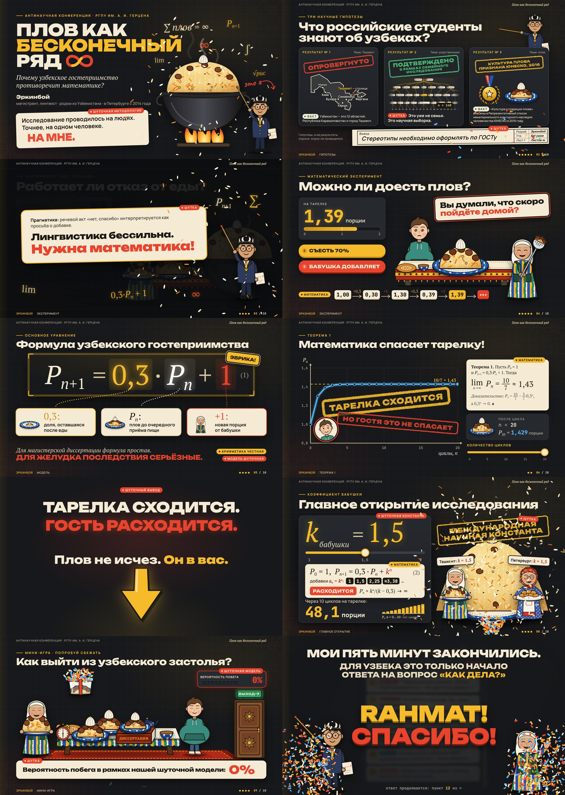

# Плов как бесконечный ряд

Интерактивный научный стендап на 5 минут для Антинаучной конференции РГПУ им. А. И. Герцена:
«Плов как бесконечный ряд: математическая модель узбекского гостеприимства». Докладчик — Эркинбой.

## Как показывать

1. Откройте **`plov.html`** в Chrome, Edge или Firefox (двойной клик). Интернет не нужен: шрифты, графика, звуки и скрипты встроены в файл.
2. Нажмите **F** — полный экран. Слайды масштабируются под любой экран и проектор (16:9; на 4:3 будут поля сверху и снизу).
3. Если есть второй экран, нажмите **P** — откроется окно докладчика: заметки, общий таймер и таймер слайда, кнопки «Назад/Далее». Перетащите его на ноутбук, а презентацию — на проектор.

| Клавиша | Действие |
|---|---|
| → · PageDown · Пробел · Enter | следующий шаг слайда (нажать кнопку на слайде), затем следующий слайд |
| ← · PageUp | предыдущий слайд |
| ↓ · ↑ | следующий / предыдущий слайд, пропуская шаги |
| 1 · 2 · 3 | кнопки на слайдах 2, 4, 9 и 10 |
| F | полный экран |
| P | окно докладчика |
| N | заметки поверх слайда (для репетиции на одном экране) |
| T | таймер на слайде |
| R | перезапустить текущий слайд |
| M | звук вкл/выкл |
| B или . | чёрный экран |
| H | подсказка по клавишам |

Мышью: все кнопки и ползунки на слайдах работают; внизу справа появляется панель со стрелками; клик по левому/правому краю экрана — назад/вперёд. Кликеры для презентаций (PageUp/PageDown) поддерживаются.

Шпаргалка с репликами и таймингом — [`speaker-notes.md`](speaker-notes.md).

## PowerPoint-версия

**`plov.pptx`** — самая близкая к HTML версия для PowerPoint (2016 и новее; рассчитана на PowerPoint, в Google Slides и Keynote анимации и триггеры теряются частично или полностью). Те же 10 слайдов: иллюстрации — картинки, снятые с HTML-версии; все надписи — живой текст PowerPoint (русская проверка орфографии); интерактив — анимации по щелчку, триггеры, пути движения и встроенные звуки эффектов. Заметки докладчика — в заметках к каждому слайду, с подсказкой, что и куда щёлкать.

- **Показ:** F5 (или «С начала»). → · PageDown · Пробел · кликер · щелчок мышью по свободному месту — следующий шаг слайда, затем следующий слайд. Шаги повторяют путь «Далее» HTML-версии.
- **Только мышью (триггеры):** на слайде 9 кнопки-отговорки А, Б, В (в любом порядке; → до попыток сразу покажет итог), на слайде 10 кнопки «Ответить кратко» / «Ответить по-узбекски». Щелчок по печатям, казану, членам формулы и т. п. — «бонусная» анимация, слайд при этом не листается.
- **Отличия от HTML:** кнопки 1/2/3 не работают — шаги идут по порядку; ползунки (слайды 6 и 8) не перетаскиваются, а едут сами по щелчку; нет окна докладчика с таймерами — используйте режим докладчика PowerPoint.
- **Шрифты:** Arial Black (заголовки), Calibri, Cambria (формулы), Segoe Print (рукописные пометки), Consolas (цифры) — стандартные шрифты Windows и Office; на Mac без Segoe Print пометки будут другим шрифтом.

Сборка (нужны Node 18+, Python 3 с Pillow и numpy, Playwright с Chromium): `cd plov/pptx && npm install && node build-pptx.mjs` — соберёт `plov.html` при необходимости, снимет картинки со слайдов, синтезирует звуки и запишет `plov/plov.pptx`. Модули слайдов — `pptx/slides/NN.mjs`, правила — `pptx/CONTRACT.md`, покадровая проверка — `pptx/qa-states.py`.

## Как устроено

- `src/` — исходники: `core.css` (дизайн-система), `core.js` (движок, звуки, частицы), `art.js` (персонажи и предметы в SVG), `chart.js` (графики), `slides/NN-*.{html,css,js}` — слайды, `fonts/` — шрифты (OFL).
- `tools/build.mjs` — собирает `plov.html`: `node plov/tools/build.mjs`.
- `tools/shoot.mjs` — скриншоты и прогон сценариев в Chromium (Playwright) для проверки.
- `tools/notes.mjs` — пересобирает `speaker-notes.md` из заметок слайдов.
- `CONTRACT.md` — правила для авторов слайдов.

Шрифты: Unbounded, Manrope, Caveat, JetBrains Mono и Plov Serif (подмножество PT Serif от ParaType, переименовано по условиям лицензии) — все под SIL Open Font License, тексты лицензий в `src/fonts/LICENSES.txt`.
